# CrabSID

[](https://github.com/mlund/crabsid/releases/latest)
[](https://github.com/mlund/crabsid/releases)
[](LICENSE)

A TUI and command-line SID music player for C64 SID music playback. Written in Rust and emulates the MOS 6502 CPU and MOS 6581/8580 SID chip using ReSid. Supports multi-SID tunes with 2-3 chips for 6-9 voice playback.


## Features

- 🎵 **PSID Playback** — Plays PSID format files (RSID/CIA-driven tunes require full C64 emulation)
- 🔊 **Multi-SID Support** — 2SID and 3SID tunes (PSID v3+) with 6-9 voices
- 🎛️ **Dual Chip Emulation** — MOS 6581 and MOS 8580 SID chip support
- ⚙️ **MOS 6502 CPU** — Full emulation with illegal opcodes
- 🌍 **PAL/NTSC Timing** — Auto-detection from file headers
- ⏭️ **Multi-Song Navigation** — Prev/next subsong controls
- 🌐 **HVSC Browser** — Browse and stream directly from the High Voltage SID Collection
- 🔍 **HVSC Search** — Search across 50,000+ SID files by path, title, or artist
- ⏱️ **Songlengths** — Auto-advances using HVSC song duration database
- 📁 **Local HVSC** — Use a local HVSC copy with `file://` URLs for offline playback
- 📋 **Playlist Support** — M3U playlists with local files and URLs
- 🖥️ **Terminal UI** — Powered by ratatui
  - 📊 VU meters showing per-voice envelope levels (3/6/9 voices)
  - 〰️ Oscilloscope displaying envelope waveforms for all voices
  - 🔄 Real-time chip model switching (per-SID for multi-SID tunes)
  - 🎨 Color schemes (C64, Dracula, Monokai, Gruvbox, and more)
- 🦀 **Written in Rust**

## Installation

### Pre-built Binaries

Download from [Releases](https://github.com/mlund/crabsid/releases/latest):

| Platform | Architecture | Download |
|----------|--------------|----------|
| Windows | x86_64 | [crabsid-windows-x86_64.zip](https://github.com/mlund/crabsid/releases/latest/download/crabsid-windows-x86_64.zip) |
| macOS | Apple Silicon | [crabsid-macos-aarch64.tar.gz](https://github.com/mlund/crabsid/releases/latest/download/crabsid-macos-aarch64.tar.gz) |
| macOS | Intel | [crabsid-macos-x86_64.tar.gz](https://github.com/mlund/crabsid/releases/latest/download/crabsid-macos-x86_64.tar.gz) |
| Linux | x86_64 | [crabsid-linux-x86_64.tar.gz](https://github.com/mlund/crabsid/releases/latest/download/crabsid-linux-x86_64.tar.gz) |
| Linux | ARM64 | [crabsid-linux-aarch64.tar.gz](https://github.com/mlund/crabsid/releases/latest/download/crabsid-linux-aarch64.tar.gz) |

### Build from Source

Requires Rust toolchain. ALSA development libraries needed on Linux:

```bash
# Debian/Ubuntu
sudo apt install pkg-config libasound2-dev

# Build and install
cargo install --path .
```

## Usage

```bash
crabsid                          # Start with HVSC browser
crabsid music.sid                # Play file and add to playlist
crabsid music.sid --song 3       # Play subsong 3
crabsid music.sid --chip 8580    # Force 8580 chip emulation
crabsid -l mylist.m3u            # Load playlist
crabsid --no-tui music.sid       # Headless mode
crabsid --hvsc-url file:///path/to/HVSC/C64Music  # Use local HVSC
```

## Keyboard Controls

### Player
| Key | Action |
|-----|--------|
| `Space` | Pause/Resume |
| `1-9` | Jump to subsong 1-9 |
| `+/-` | Next/previous subsong |
| `s` | Cycle SID chip model (6581/8580) |
| `c` | Color scheme picker |
| `a` | Add current song to playlist |

### Browser
| Key | Action |
|-----|--------|
| `Tab` | Switch between Playlist and HVSC |
| `Up/Down` | Navigate |
| `Enter` | Play file / Enter directory |
| `Left/Backspace` | Go up / Remove from playlist |
| `/` | Search HVSC (Esc to cancel) |

### General
| Key | Action |
|-----|--------|
| `h/?` | Show help |
| `q` | Quit |

## Options

| Option | Description |
|--------|-------------|
| `-s, --song <N>` | Subsong number to play (default: from file) |
| `-c, --chip <MODEL>` | SID chip: 6581 or 8580 (default: from file) |
| `-l, --playlist <FILE>` | Load M3U playlist |
| `--hvsc-url <URL>` | HVSC mirror URL or local path (file://) |
| `--playtime <SECS>` | Max song duration before auto-advance (default: 180) |
| `--no-tui` | Disable TUI, simple text output |

## Architecture

```mermaid
flowchart TB
    subgraph Input
        CLI[CLI args]
        SID[.sid file]
        M3U[.m3u playlist]
        HVSC[(HVSC Online)]
    end

    subgraph Core["Emulation Core"]
        CPU[MOS 6502 CPU<br/>mos6502]
        MEM[C64 Memory<br/>64KB RAM]
        SIDCHIP[SID Chips 1-3<br/>resid-rs]
        CPU <--> MEM
        MEM <--> SIDCHIP
    end

    subgraph Player["Player Thread"]
        PLAYER[Player]
        PLAYER --> CPU
        PLAYER --> SIDCHIP
    end

    subgraph Audio["Audio Thread"]
        AUDIO[tinyaudio]
        BUFFER[Audio Buffer]
    end

    subgraph UI["TUI · ratatui"]
        APP[App State]
        VU[VU Meters]
        SCOPE[Oscilloscopes]
        BROWSER[HVSC Browser]
        PLAYLIST[Playlist Browser]
        APP --> VU
        APP --> SCOPE
        APP --> BROWSER
        APP --> PLAYLIST
    end

    CLI --> PLAYER
    SID --> PLAYER
    M3U --> PLAYLIST
    HVSC --> BROWSER

    PLAYER <-->|Arc Mutex| APP
    PLAYER --> BUFFER
    BUFFER --> AUDIO
    SIDCHIP -->|envelope| SCOPE
    SIDCHIP -->|levels| VU
```



## License

The `crabsid` crate is licensed under the GNU General Public License v3.0 due to its dependency on `resid-rs` which is GPLv3 licensed.

Individual source files are MIT licensed.
